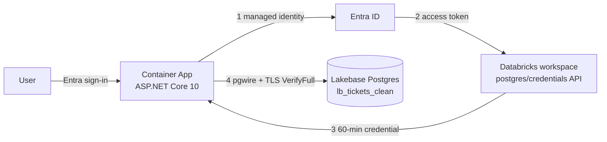

# Support Tickets Dashboard

An ASP.NET Core dashboard on Azure Container Apps that reads Databricks Lakebase
(Postgres) directly, using Microsoft Entra ID end to end. No database password
exists anywhere: the Lakebase project has native Postgres login disabled.

Live: `https://tickets-dashboard.politebush-8a7978e7.eastus2.azurecontainerapps.io`

## Architecture



The credential in step 3 travels in the Postgres password field. That is the
transport, not a stored secret — it is an Entra-derived token valid for 60
minutes, refreshed automatically by `NpgsqlDataSource` every 45.

## Layout

| Path | Purpose |
| --- | --- |
| `app/` | Dashboard: API, static UI, Dockerfile |
| `tests.dashboard/` | Unit tests for options and filter validation |
| `infra/main.bicep` | Container App, environment, registry, built-in auth |
| `setup/lakebase-role.sql` | Postgres role and read-only grants |

## Data

`dbdemos_aibi_customer_support.lb_tickets_clean` — 24,872 rows synced from Unity
Catalog, spanning 2024-05-01 to 2025-07-26 across EMEA, APAC and AMER.

## Permissions

Lakebase enforces two independent layers. Both are required; either alone fails.

| Layer | Grants | Where |
| --- | --- | --- |
| Workspace | Service principal with `workspace-access`, `CAN_USE` on the project | Databricks SCIM + project ACL |
| Database | Postgres role + `SELECT` | `setup/lakebase-role.sql` |

The Postgres role name is the managed identity's **client ID**, and it is
case-sensitive. The identity is referenced (not created) by the Bicep template,
because that client ID is baked into both layers — a new identity would silently
lose all access.

## Local development

Requires .NET 10 and an `az login` session that can reach the workspace.

```bash
dotnet run --project app --urls http://localhost:5180
```

`app/appsettings.Development.json` sets `Identity:UseDeveloperCredential`, which
switches to `AzureCliCredential`. That flag is rejected outside the Development
environment.

Build and test the whole solution:

```bash
dotnet build TicketsDashboard.slnx
dotnet test  TicketsDashboard.slnx
```

## First-time identity setup

Creating the identity is one step; wiring it up takes three more. Workspace-admin
rights in Databricks are sufficient — account-admin is not required.

1. Create it: `az identity create -g tickets-dashboard-rg -n tickets-id -l eastus2`
2. Register it in the workspace via SCIM (`/api/2.0/preview/scim/v2/ServicePrincipals`)
   with the `workspace-access` entitlement, using its **client ID** as `applicationId`
3. Grant `CAN_USE` on the project:
   `PATCH /api/2.0/permissions/database-projects/lakebaseproject1`
4. Run `setup/lakebase-role.sql`, substituting that same client ID

Skipping step 2 or 3 fails at the credential exchange; skipping step 4 fails at
the Postgres connection.

## Deploy

```bash
az acr build --registry ticketsacrjuimgm6jl3a66 --image tickets-dashboard:v1 ./app

az deployment group create -g tickets-dashboard-rg --template-file infra/main.bicep \
  --parameters authClientId=23b870db-bb0b-433e-822c-71fe161819a6 \
               authClientSecret=<secret> \
               containerImage=ticketsacrjuimgm6jl3a66.azurecr.io/tickets-dashboard:v1
```

`az acr build` compiles in Azure, so Docker is not needed locally. Always pass
`containerImage`: it defaults to a placeholder, and omitting it rolls the app back.

After the first deployment, set the auth app registration's redirect URI to the
template's `redirectUri` output, or sign-in fails.

### Deployed resources

| Resource | Value |
| --- | --- |
| Resource group | `tickets-dashboard-rg` (eastus2) |
| Container App | `tickets-dashboard` |
| Registry | `ticketsacrjuimgm6jl3a66.azurecr.io` |
| Managed identity | `tickets-id` — `2135cf05-7867-43e6-b84f-d6e6fd7c90de` |
| Auth app registration | `tickets-dashboard-auth` — `23b870db-bb0b-433e-822c-71fe161819a6` |

The Container App and Lakebase both sit in eastus2; co-locating them matters,
since every dashboard request makes a round trip to Postgres.

## Two non-obvious constraints

**Use the direct endpoint host, not `-pooler`.** The PgBouncer pooler rejects
Lakebase OAuth credentials with `08P01: SASL authentication failed`. Connections
are pooled in-process instead. `LakebaseOptions` fails fast if a pooler host is
configured.

**The connection is warmed at startup.** Fetching the credential lazily made the
first request fail with `Authentication timed out`, because the token exchange
ran mid-handshake and Postgres cut it off. `ConnectionWarmup` opens one
connection before traffic arrives.

## Costs

`minReplicas: 1` keeps one replica warm so the rotating credential stays cached,
which means continuous billing rather than scale-to-zero.

The Lakebase compute suspends after 5 minutes idle (`suspend_timeout_duration:
300s`) and resumes on the next query. Databricks documents resume as a few
hundred milliseconds; that was not measured here.

## Measured performance

| | |
| --- | --- |
| Full-range dashboard query, in-region | ~210 ms |
| Warm filtered count | ~68 ms |
| Same full-range query from a laptop | ~500 ms |

The gap between the first and third rows is network distance, not database work.
